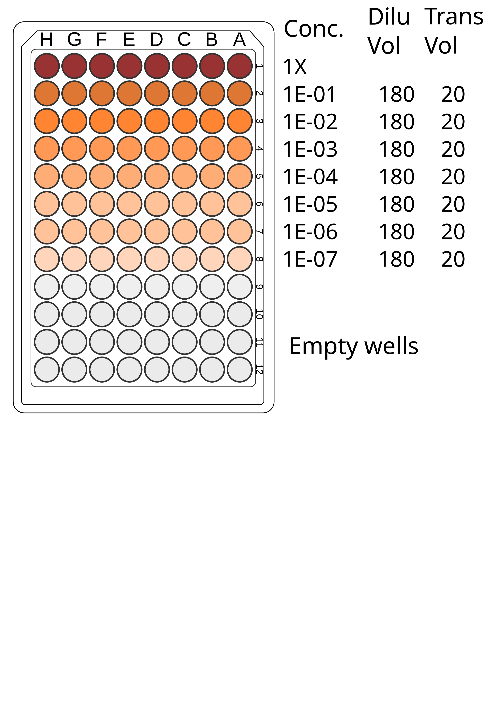
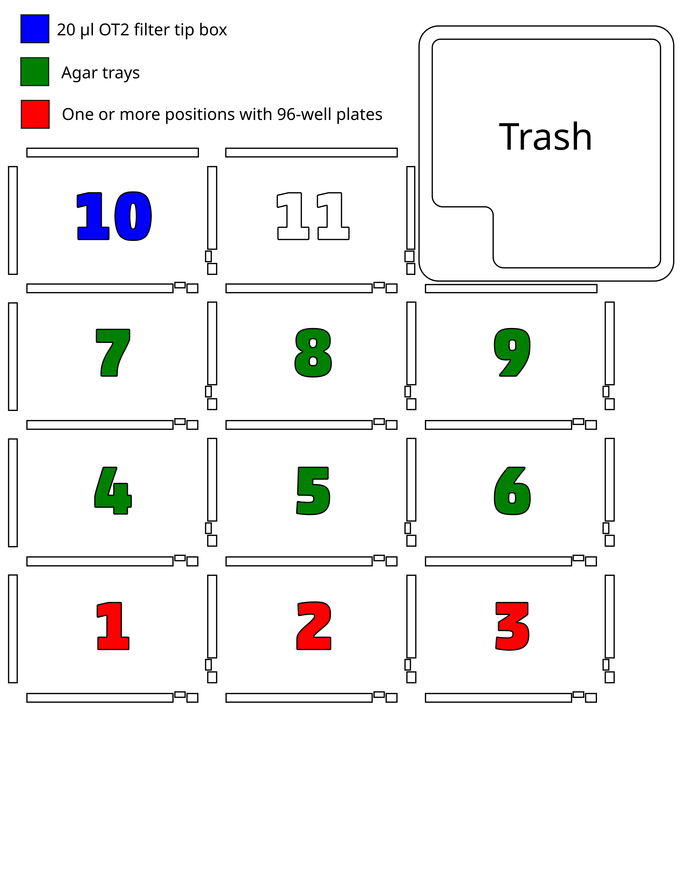

# Introduction

This is a protocol to dilute and spot bacteria for colony forming unit (CFU) quantification. Bacterial samples are passed through a series of 10x and 2x serial dilutions with each dilution spotted onto a rectangular agar plate such as the [Nunc OmniTray](https://www.sigmaaldrich.com/FI/en/product/sigma/o0764) or something similar. These plates are incubated for some duration of time and the resulting colonies are counted at different dilutions. Plates may also be imaged using an instrument like the Evos m7000. The protocol can process up to 24 bacterial samples at a time (3 plates x 8 wells (1 column) per plate). This protocol was inspired by the protocol [available here](https://protocols.opentrons.com/protocol/33y0f3).

# Reagents

- Rectangular tray (e.g., the [Nunc OmniTray](https://www.sigmaaldrich.com/FI/en/product/sigma/o0764) or something similar) with *30 ml* of the selective agar of choice, sterile. Agar trays should be dried on as flat a surface as possible to ensure consistent heights across the plate.
- Sterile M9 for dilution

# Equipment/Consumables

- Standard lab 1-well reservoir (the kind that can be autoclaved) for M9 dilutant (e.g., axygen_1_reservoir_90ml)
- 96 well plates for the serial dilution

- [Opentrons P20 8 Channel Electronic Pipette (GEN2)](https://shop.opentrons.com/8-channel-electronic-pipette/)
- [Opentrons OT-2 96 Tip Racks - 20 µL](https://shop.opentrons.com/opentrons-20-l-tips-160-racks-800-refills/)
- [Opentrons P300 8 Channel Electronic Pipette (GEN2)](https://shop.opentrons.com/8-channel-electronic-pipette/)
- [Opentrons OT-2 96 Tip Rack - 300 µL](https://shop.opentrons.com/opentrons-300ul-tips-1000-refills/)

# IMPORTANT: Editing scripts and tip management
If you need to change defaults in these scripts you will need to edit the scripts directly before importing them into the Opentrons app. The main variables that need to be changed are in the "Global Vars" section of each script, which include the deck locations for the different plates, the dilution volumes to be used, and the position of the pipettes on the robot (e.g., left or right).

**Important!** We will always need to start the protocol from column A of a tip box. With the multichannel you cannot specify a different column to start with. The pipette will always start at A1.

# Procedure

The main process is divided into three steps/scripts

## 1) Distribute dilutant

Load 96-well plates and **one 300 ul tip box (does not need to be filter tips)** in the orientation as shown in Figure 1. One 96-well plate can be used for a full dilution series of 8 samples. The default is to run three plates at one time (24 total samples, Figure 1) which is the largest capacity the robot can handle in one batch.

**IMPORTANT:** Make sure you do a "Labware position check" before this run. Importantly, set the z offset to be **5 mm above the container edge** when you calibrate the reservoir z-axis. This will make sure the pipette doesn't jam tips into the bottom of the reservoir when it aspirates

|  |
| - |
| **Figure 1:** Deck layout for distributing dilutant to plates |

[Import](https://support.opentrons.com/s/article/Get-started-Import-a-protocol) and [run](https://support.opentrons.com/s/article/Get-started-Run-your-protocol) the python script `01_cfu_distribute_dilutant.py.` Figure 2 shows the 96-well plate layout. The script will add 180 µl of dilutant to columns 2-9 for the serial dilution in the next transfer step.

|  |
| - |
| **Figure 2:** Concentrations for the serial dilution series in a plate |

Note that columns 7, 9, and 11 are 2-fold dilutions of the previous column. This is done to optimize the dynamic range of CFUs for counting, but it will probably take some trial and error to select which dilutions in the series to use for the final count.

The only work that needs to be done outside of the OT-2 is to load 100 µL of your samples into column 1 of the plate inside of a biosafety cabinet. **IMPORTANT:** you need at least 9 ml of dilutant to run the procedure for 3 plates. After a plate has finished place a lid over the plate.

If you do no wish to use the robot to add dilutant to the plate, then you can use a multichannel pipette to add **180 µl** to columns 2-9.

## 2) Serial dilution and agar spotting

Keep the 96-well plates in the same positions as in the distribute dilutant step. Load **20 and 200 or 300 µl OT2 filter tip boxes** and agar trays in the orientation as shown in Figure 3.

|  |
| - |
| **Figure 3:** Deck layout for performing the serial dilutions |

[Import](https://support.opentrons.com/s/article/Get-started-Import-a-protocol) and [run](https://support.opentrons.com/s/article/Get-started-Run-your-protocol) the python script `02_cfu_serial_dilution_spot.py.` This script performs two distinct subprotocols. First, it performs the serial dilution series for each plate in the concentrations of Figure 2. It uses the p300 multichannel pipette and 200/300 µl tips, exchanging tips for each dilution.

Next, the robot switches to the p20 multichannel pipette and uses 20 µl tips to draw from the dilutions of 1E-08, 1E-07, 1E-06, and 1E-05 and spots a small aliquot of these dilutions to agar. In this step, the robot works backwards from most dilute to most concentrated so that it does not need to exchange tips each time. **It is very important** to perform the ["Labware Position Check"](https://support.opentrons.com/s/article/How-positional-calibration-works-on-the-OT-2#LPC) which will allow you to [set offsets](https://support.opentrons.com/s/article/How-Labware-Offsets-work-on-the-OT-2) specific for the rectangular trays with agar. **MOST IMPORTANT** is to set the "z" offset for the agar plates so that the OT-2 considers the "top of the well" as when the pipette tips are just barely above the agar.

## 3) Additional agar spotting from the same dilutions

For some protocols you might need to spot culture to both nutrient agar and, for example, nutrient agar with a counter selective antibiotic. In this case you don't need to perform dilution again and you can proceed to running a protocol that just transfers from the 96-well plates to a new agar tray. Keep the same orientation as in Figure 3, but swap out the agar trays in deck slots 4, 5, and 6. Here it is important to keep track of the 20 µl tips that have been used in the previous step. The starting tip position can can be set using the `STARTING_TIP` variable on line 26 of `03_cfu_plate_spotting.py.`

[Import](https://support.opentrons.com/s/article/Get-started-Import-a-protocol) and [run](https://support.opentrons.com/s/article/Get-started-Run-your-protocol) the python script `03_cfu_plate_spotting.py.` Again it is important to perform the ["Labware Position Check"](https://support.opentrons.com/s/article/How-positional-calibration-works-on-the-OT-2#LPC) which will allow you to [set offsets](https://support.opentrons.com/s/article/How-Labware-Offsets-work-on-the-OT-2) specific for the rectangular trays with agar. **MOST IMPORTANT** is to set the "z" offset for the agar plates so that the OT-2 considers the "top of the well" as when the pipette tips are just barely above the agar.
